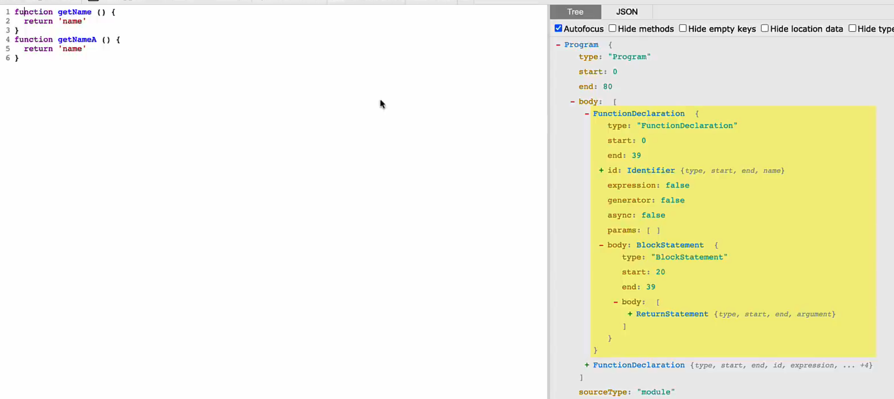
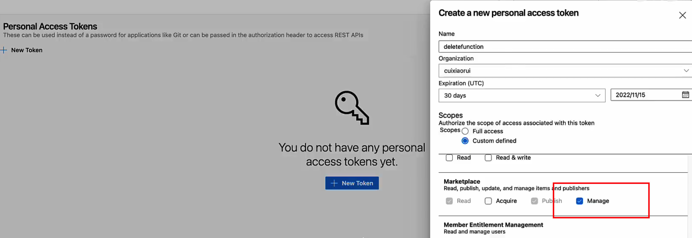
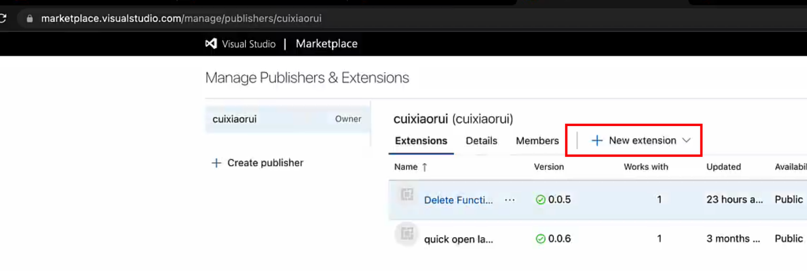

# vsc-delete-func

实现的插件功能是一键删除函数，可以让用户通过命令以及快捷键调用，提高编码效率

typescript、单元测试的使用技巧、vscode插件脚手架、vscode发布插件、ast 

需求分析

1. 用户可以通过快捷键的方式删除光标所在的函数

2. 用户可以通过命令的方式删除光标所在的函数

Tasking

1. vscode应该如何删除指定的字符

2. 如何获取光标所在的function的范围

ast



生成ast：babel

💻 vscode 插件教程 Your First Extension:

https://code.visualstudio.com/api/get-started/your-first-extension


调试：

- f5 调试

- 单元测试


# 部署

1. vsce login sunny

2. 注册

3. token



4. vsce package --yarn

如果失败，先删除 node_modules, 重新用 yarn 安装

5. 发布

方法1



方法2

vsce publish --yarn

```json
// 加上 
"publisher": "cuixiaorui",
```

# Reference

https://www.npmjs.com/package/generator-code
https://juejin.cn/post/7032977183790333960
https://github.com/cuixiaorui/delete-function.git
注册：https://azure.microsoft.com/zh-cn/products/devops/?cdn=disable
